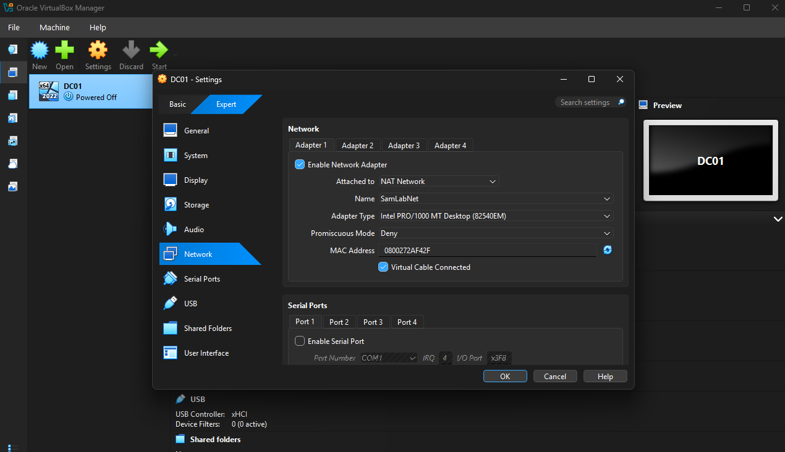

# 02 — Domain Controller (DC01)

## Objective

Stand up a Windows Server 2022 domain controller, create the `samlab.local` forest, and populate
Active Directory with an OU structure, users, and groups — the identity backbone of the lab.

## Specs

- **VM name:** `DC01`
- **OS:** Windows Server 2022 Standard (Desktop Experience), Evaluation edition
- **Resources:** 4 GB RAM, 2 vCPU, 50 GB dynamic disk
- **Network:** NAT Network `SamLabNet`, static IP `10.10.10.10`

## 1. Create the VM

- **New** → name `DC01`, version **Windows 2022 (64-bit)**, with **Skip Unattended Installation**
  checked so the OS could be installed manually.
- Allocated 4096 MB RAM, 2 processors, and a 50 GB dynamically allocated disk.
- Attached **Adapter 1** to the **NAT Network `SamLabNet`**.

