# 02 — Domain Controller (DC01)

## Objective

Stand up a Windows Server 2022 domain controller, create the `samlab.local` forest, and populate
Active Directory with an OU structure, users, and groups — the identity backbone of the lab.

## Specs

- **VM name:** `DC01`
- **OS:** Windows Server 2022 Standard (Desktop Experience), Evaluation edition
- **Resources:** 4 GB RAM, 2 vCPU, 50 GB dynamic disk
- **Network:** NAT Network `SamLabNet`, static IP `10.10.10.10`

## 2.1 Create the VM

- **New** → name `DC01`, version **Windows 2022 (64-bit)**, with **Proceed with Unattended Installation**
  unchecked so the OS could be installed manually.
- Allocated 4096 MB RAM, 2 processors, and a 50 GB dynamically allocated disk.
- Attached **Adapter 1** to the **NAT Network `SamLabNet`**.

### 2.2 Install the OS
1. Boot the VM → choose language → **Install now**.
2. Select **Windows Server 2022 Standard (Desktop Experience)** — the GUI edition, *not* the
   bare "Server Core" option.
3. **Custom install** → select the disk → install → set the **Administrator** password.

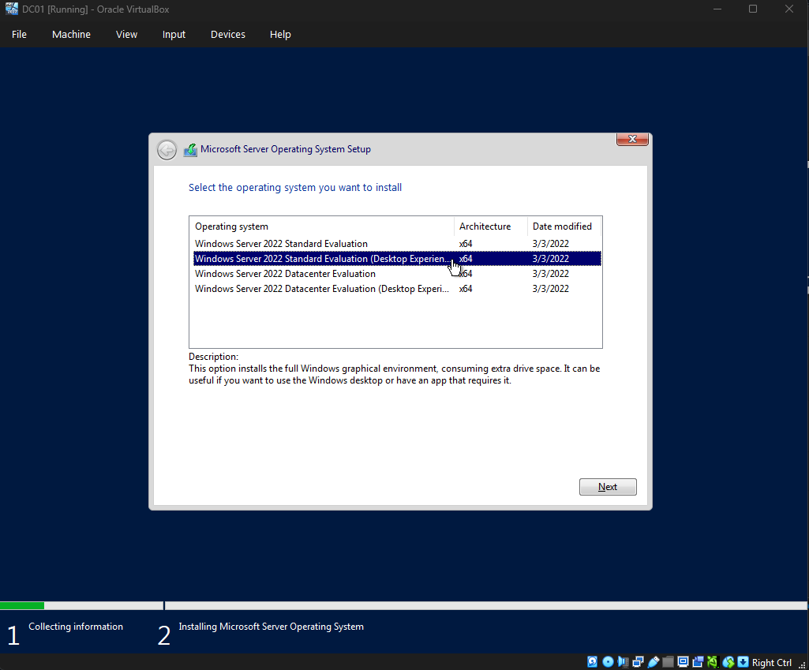
 
4. Install **VirtualBox Guest Additions** for better display/clipboard.

### 2.3 Static IP + rename
1. Network adapter → IPv4 properties:
   - IP `10.10.10.10`, mask `255.255.255.0`, gateway `10.10.10.1`, DNS `127.0.0.1`.

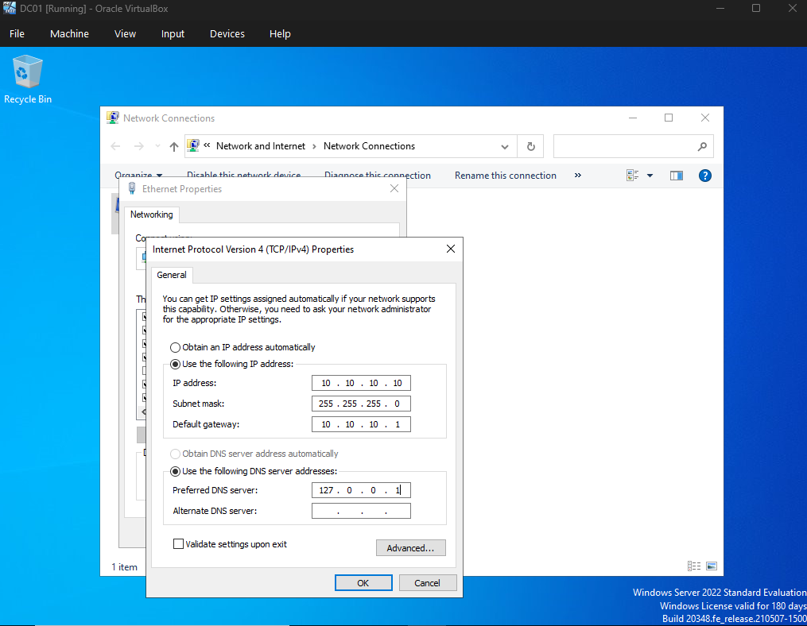
 
2. Rename the computer to `DC01` (Settings → System → About → Rename, or `sysdm.cpl`) → reboot.

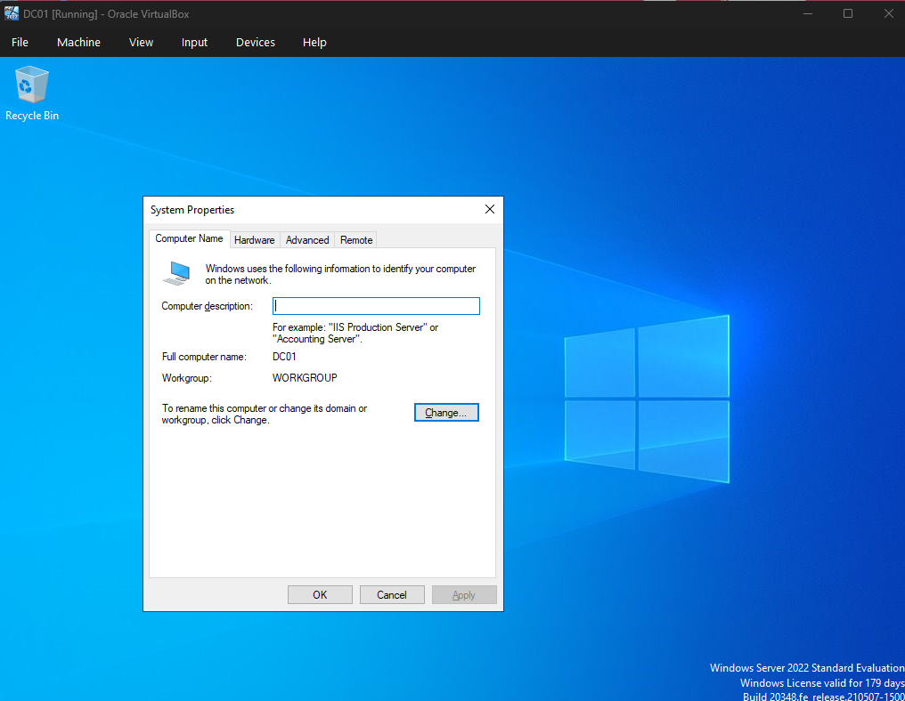
 
### 2.4 Install the AD DS role
1. **Server Manager** → **Manage** → **Add Roles and Features**.
2. Role-based install → select the local server → check **Active Directory Domain Services** →
   **Add Features** → finish the wizard → **Install**.
   
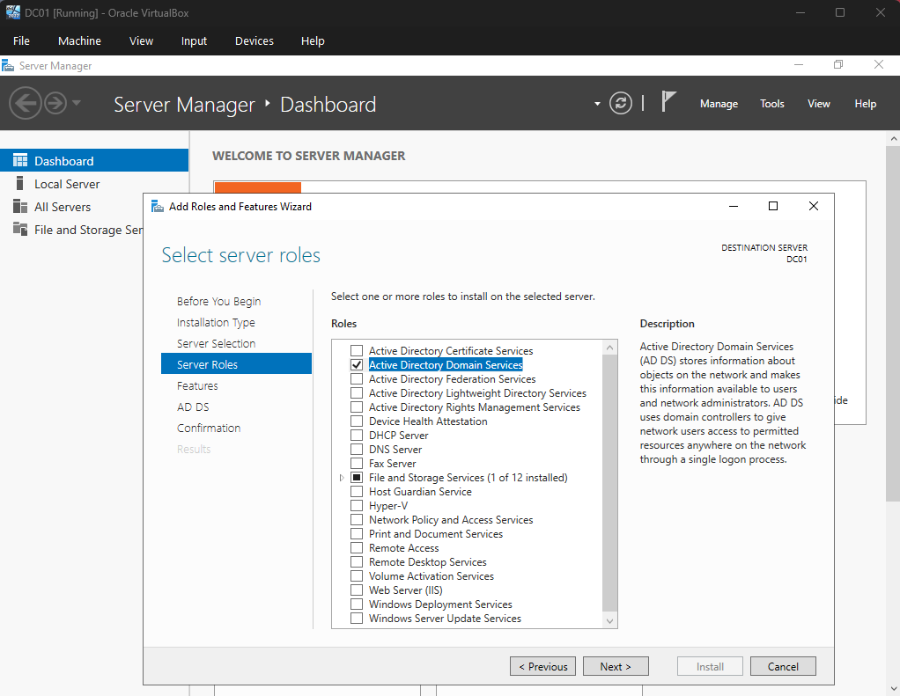

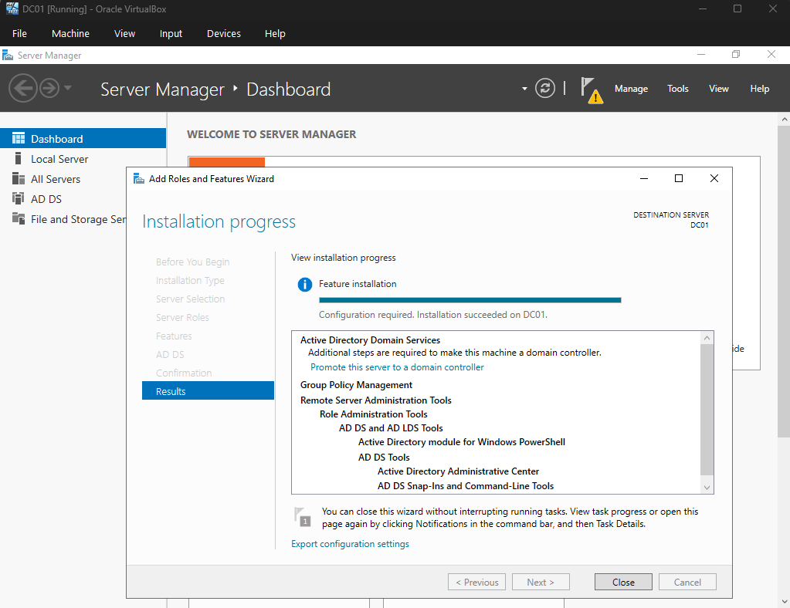
 
### 2.5 Promote to Domain Controller
1. Click the yellow **notification flag** in Server Manager → **Promote this server to a domain
   controller**.
2. **Add a new forest** → Root domain name: **`samlab.local`**.
3. Set the **DSRM** (Directory Services Restore Mode) password. Confirm the NetBIOS name `SAMLAB`.
4. Continue through the wizard → **Install**. The server reboots automatically.

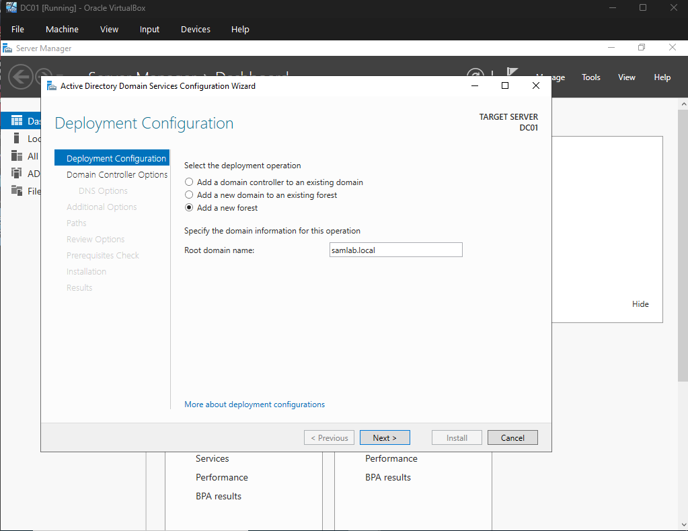

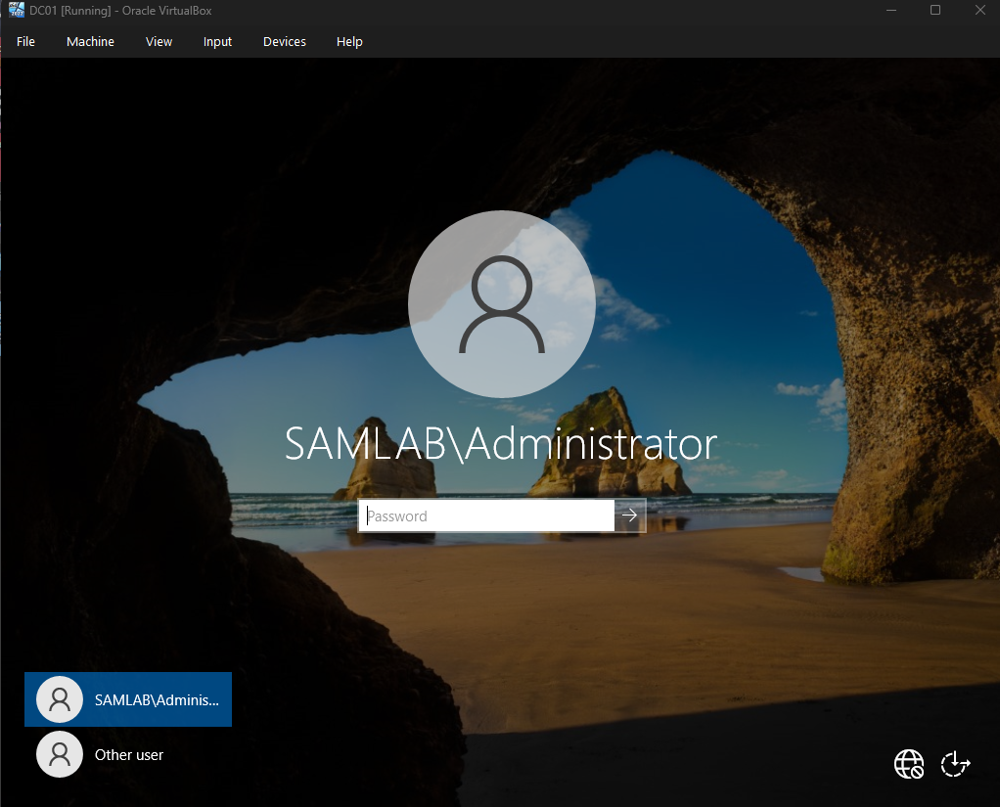
 
### 2.6 Verify and populate AD
1. **Server Manager → Tools → Active Directory Users and Computers** (`dsa.msc`).

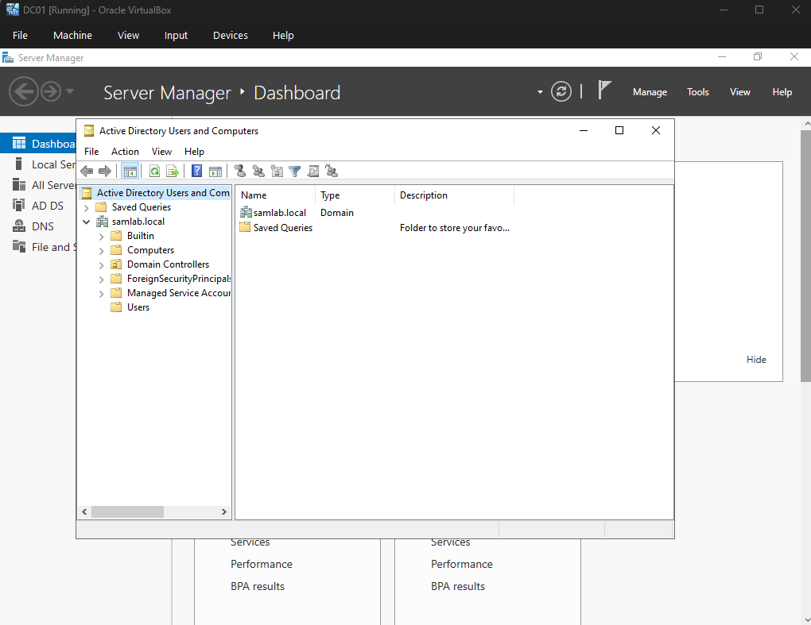
 
2. Create an OU structure, e.g. an OU `SamLab` containing sub-OUs `Users`, `Workstations`, `Groups`.
3. Create 2–3 test users (e.g. `jdoe`, `asmith`) with passwords.

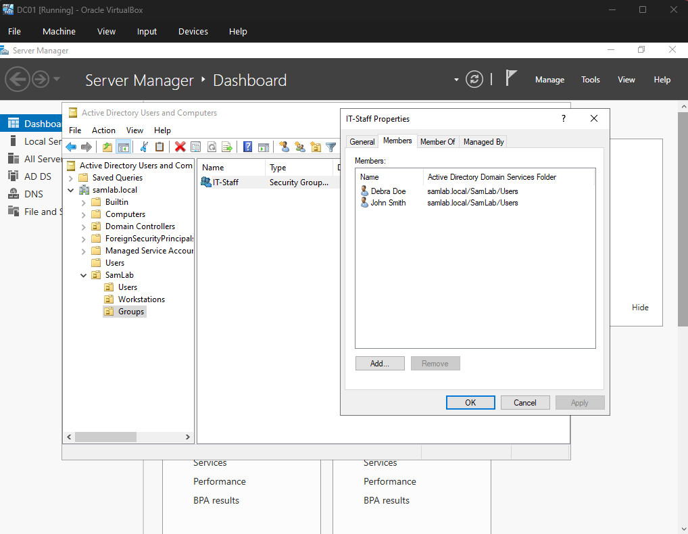
 
4. **Tools → DNS** → expand Forward Lookup Zones → `samlab.local` to confirm the
   SRV records AD created. If external resolution is flaky, add a forwarder (e.g. `8.8.8.8`)
   under the DNS server's **Forwarders** tab.

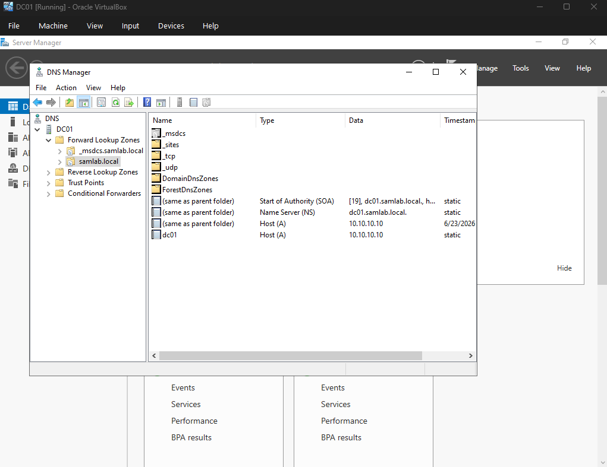

### 2.7 Configure a Group Policy (logon warning banner)

1. Opened **Group Policy Management** (Server Manager → Tools → Group Policy Management).
2. Right-clicked the `samlab.local` domain → **Create a GPO in this domain, and Link it here…** → named it `Logon Banner Policy`.

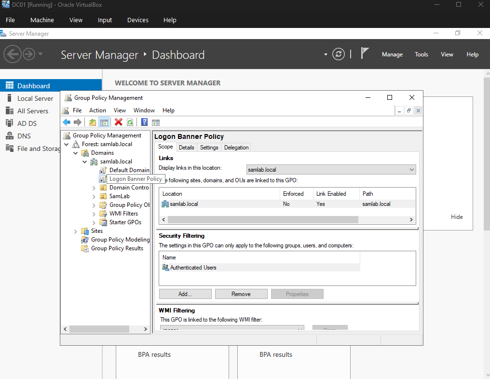

3. Edited the GPO → **Computer Configuration → Policies → Windows Settings → Security Settings → Local Policies → Security Options**, and defined:
   - **Interactive logon: Message title for users attempting to log on** → `Authorized Use Only`
   - **Interactive logon: Message text for users attempting to log on** → a warning that the system is for authorized users only and activity may be monitored.

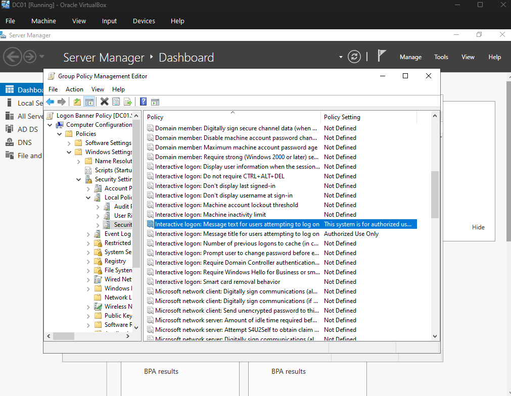

4. Ran `gpupdate /force` on `CLIENT01` and confirmed the warning banner appears before sign-in.

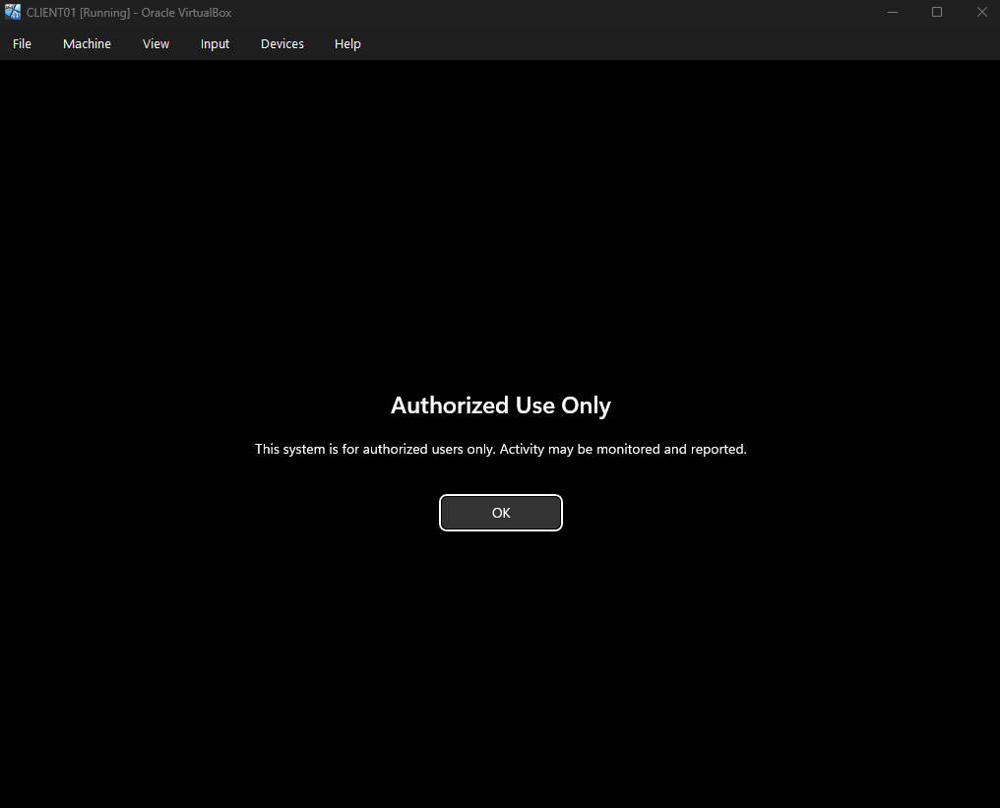
