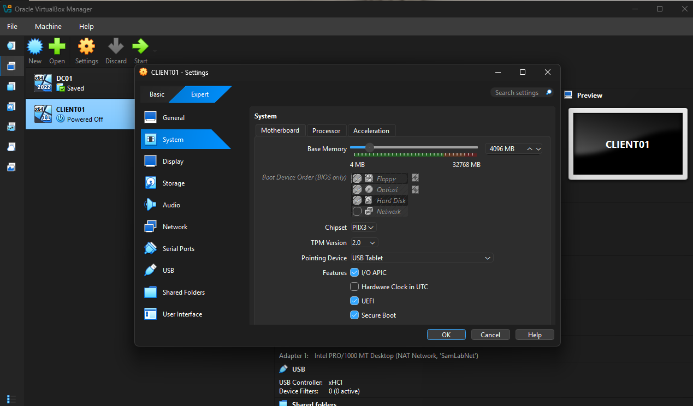

# 03 — Windows 11 Client (CLIENT01)

## Objective

Join a Windows 11 workstation to the `samlab.local` domain so it authenticates against Active
Directory. This completes the client side of the lab and makes realistic help desk scenarios
(logging in as a domain user, password resets, lockouts) possible.

## Specs

- **VM name:** `CLIENT01`
- **OS:** Windows 11 (64-bit)
- **Resources:** 4 GB RAM, 2 vCPU, 64 GB dynamic disk
- **Network:** NAT Network `SamLabNet`, DHCP with DNS pointed at `DC01` (`10.10.10.10`)

## 3.1 Create the VM

- **New** → name `CLIENT01`, version **Windows 11 (64-bit)**, with **Proceed with Unattended Installation** unchecked so the OS could be installed manually.
- Allocated 4096 MB RAM, 2 processors, and a 64 GB dynamically allocated disk.
- Enabled **EFI** and **TPM 2.0** (Settings → System), which Windows 11 requires.
- Attached **Adapter 1** to the **NAT Network `SamLabNet`**.

### 3.2 Install Windows 11 with a local account
