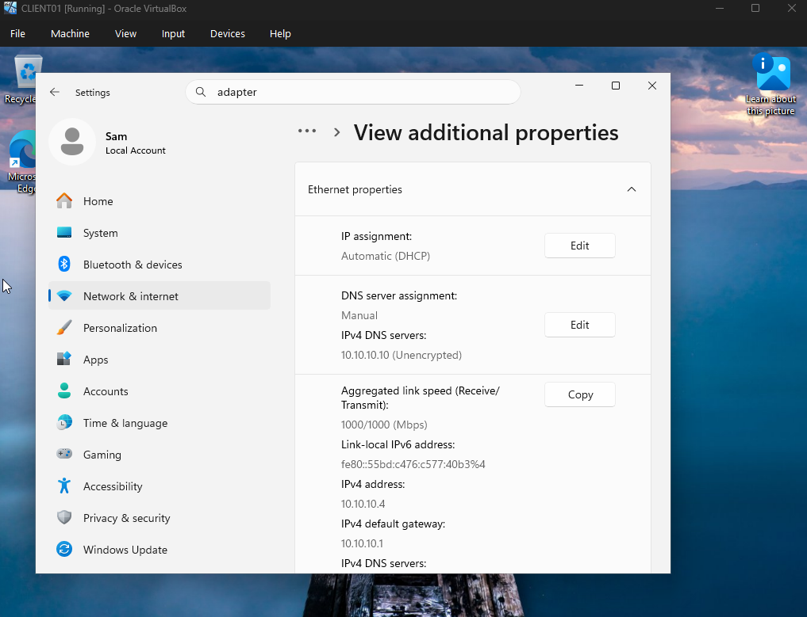
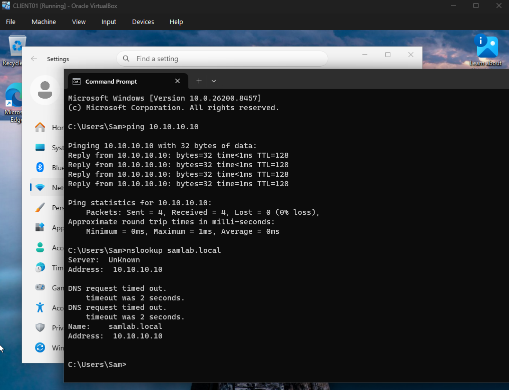
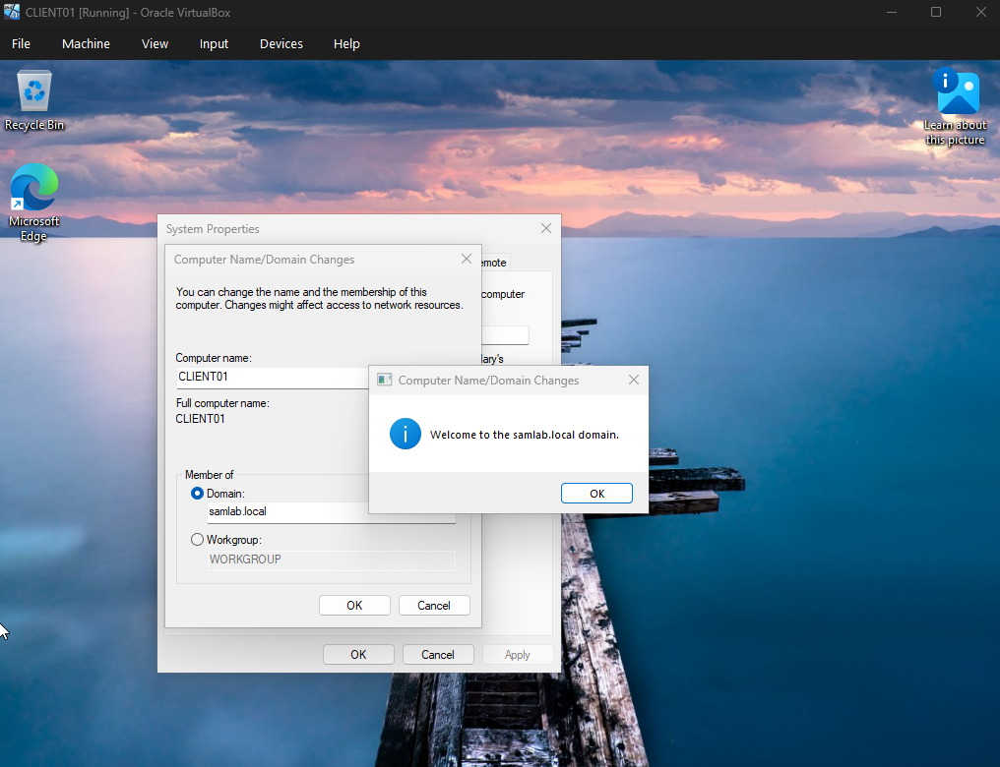
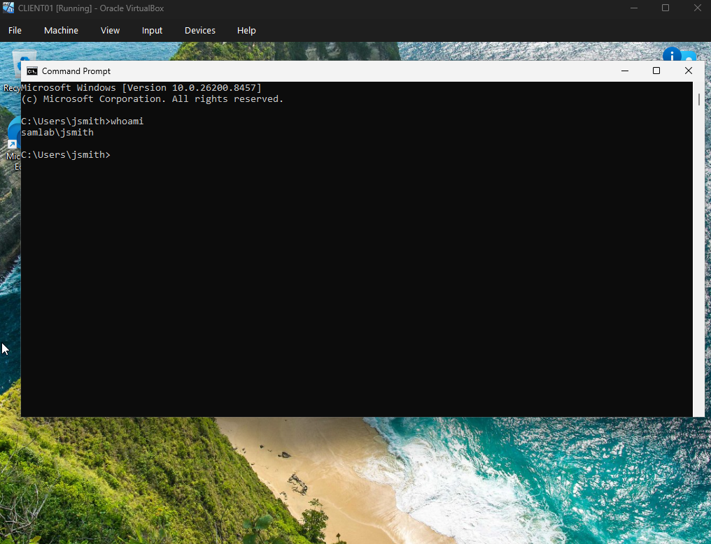
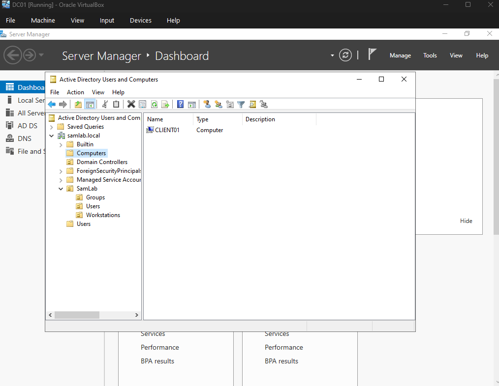

# 03 — Windows 11 Client (CLIENT01)

## Objective

Join a Windows 11 workstation to the `samlab.local` domain so it authenticates against Active
Directory. This completes the client side of the lab and makes realistic help desk scenarios
(logging in as a domain user, password resets, lockouts) possible.

## Specs

- **VM name:** `CLIENT01`
- **OS:** Windows 11 (64-bit)
- **Resources:** 4 GB RAM, 2 vCPU, 64 GB dynamic disk
- **Network:** NAT Network `SamLabNet`, DHCP with DNS pointed at `DC01` (`10.10.10.10`)

## 3.1 Create the VM

- **New** → name `CLIENT01`, version **Windows 11 (64-bit)**, with **Proceed with Unattended Installation** unchecked so the OS could be installed manually.
- Allocated 4096 MB RAM, 2 processors, and a 64 GB dynamically allocated disk.
- Enabled **EFI** and **TPM 2.0** (Settings → System), which Windows 11 requires.
- Attached **Adapter 1** to the **NAT Network `SamLabNet`**.

### 3.2 Install Windows 11 with a local account
1. Boot the VM and run the installer through to the out-of-box experience (OOBE).
2. At the network / Microsoft-account screen, press **Shift+F10** to open Command Prompt and run `start ms-cxh:localonly` to switch to local-account creation. (Legacy fallback on older builds: `OOBE\BYPASSNRO`.)
3. Create the local account and finish setup to the desktop.
4. Install **VirtualBox Guest Additions** for better display/clipboard.

### 3.3 Point DNS at the domain controller

1. Network adapter → IPv4 properties: leave the IP on **Obtain an IP address automatically**, but set **Preferred DNS server** to `10.10.10.10` (DC01). Without this, the client cannot locate the domain.

2. Verify resolution from Command Prompt — `ping 10.10.10.10` and `nslookup samlab.local` should both succeed.

### 3.4 Join the domain

1. Open **System Properties** (`sysdm.cpl`) → **Computer Name** tab → **Change…**.
2. Under **Member of**, select **Domain** and enter `samlab.local`.
3. Authenticate as `SAMLAB\Administrator` when prompted.
4. A **"Welcome to the samlab.local domain"** message confirms success. Reboot next.

### 3.5 Verify the domain join

1. At the login screen, choose **Other user** and sign in as `SAMLAB\jsmith`.
2. Open Command Prompt and run `whoami`. It returns `samlab\jsmith`, confirming a domain logon.

3. On **DC01**, refresh Active Directory Users and Computers. `CLIENT01` now appears as a computer object in the domain.

