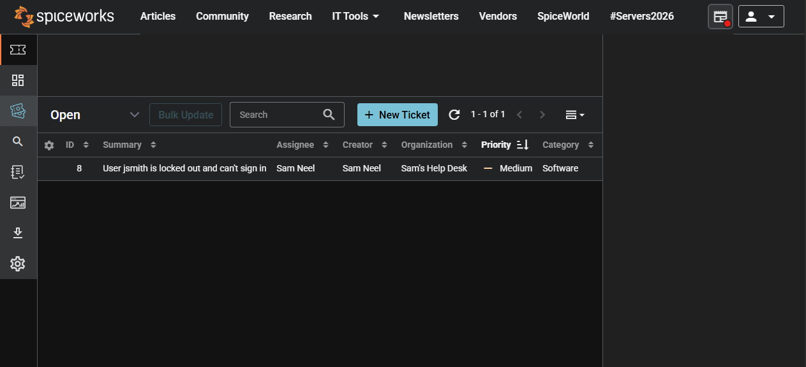
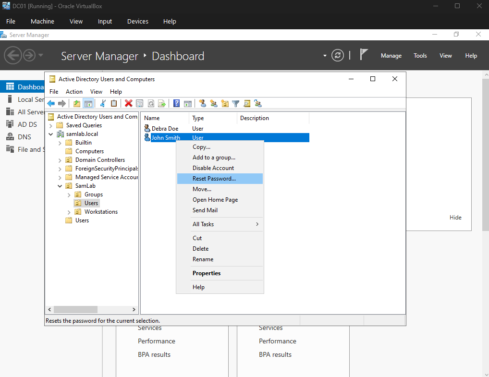
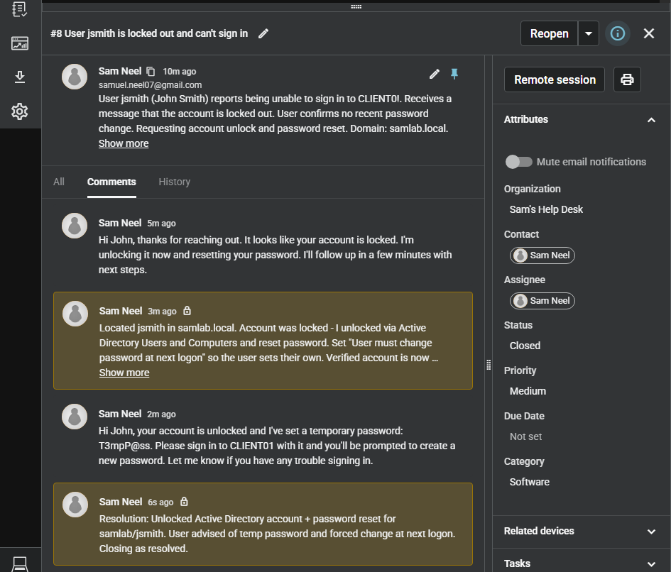

# 04 — Spiceworks Cloud Help Desk

## Objective

Stand up a help desk ticketing system and run a support ticket through its full lifecycle, tying
an Active Directory account issue to a tracked, documented resolution. This mirrors the core
Tier 1 help desk loop: a user reports a problem, a ticket is opened and tracked, the fix is
performed in AD, and the ticket is documented and closed.

## Platform

- **Spiceworks Cloud Help Desk**
- **Scenario:** a domain user (`samlab\jsmith`) is locked out; the fix is performed in Active
  Directory on `DC01`

## 4.1 Set up the help desk

1. Signed up for a Spiceworks Cloud Help Desk account and completed the initial help desk setup.

## 4.2 Open a ticket

1. Created a ticket representing a realistic support request: *"User jdoe is locked out of their account and cannot sign in."*
2. Set the requester, a clear summary, and a priority.

## 4.3 Work the ticket

1. Assigned the ticket to myself and set it to **In Progress**.
2. Performed the fix in **Active Directory Users and Computers** on DC01. I unlocked the account and reset the password for `samlab\jsmith`.
3. Added a work note to the ticket documenting exactly what was done.

## 4.4 Resolve and close

1. Marked the ticket **Resolved** and **Closed**, and gave a resolution note.

